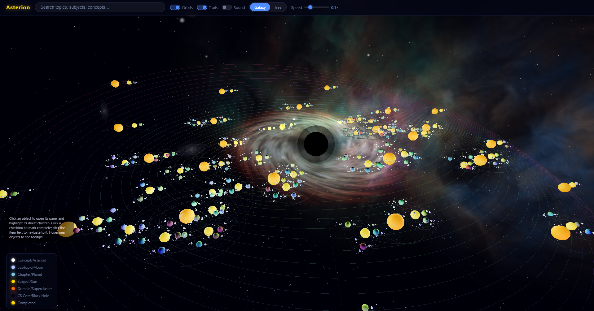

## About

Asterion turns structured, hierarchical data into an explorable 3D galaxy. Any dataset organized as nested levels — domains, subjects, chapters, subtopics, concepts — is rendered as orbiting celestial bodies around a central black hole, complete with gravitational lensing and a glowing accretion disk at the core.

Click any object to open its details panel, track completion, attach notes and reference links, and navigate the hierarchy visually, in real time, in three-dimensional space.

Built with Three.js and Tauri.

---

## Demo

<p align="center">
  
</p>

---

## Data schema

> **The schema is currently fixed.**
> You can load any dataset into `theory.json`, but it must conform to the existing schema — only text *values* can be replaced for now.
>
> - Flexible/custom schemas — *planned*
> - In-app creation of new objects — *planned*
>
> Asterion was originally built for a highly specialized use case, so these limitations are by design for now, not by accident.

---

## Setup

### Prerequisites

- [Node.js](https://nodejs.org/)
- [Rust](https://rustup.rs/)
- [Tauri prerequisites for your platform](https://tauri.app/start/prerequisites/)
- For Android builds: Android Studio + NDK (see below)

### 1. Clone the repo

```bash
git clone <repo-url>
cd asterion
```

### 2. Install packages

```bash
npm install
```

### 3. Run in dev mode

```bash
npx tauri dev
```

### 4. Build the desktop executable

```bash
npx tauri build
```

**Output locations:**

```
src-tauri\target\release\asterion.exe
src-tauri\target\release\bundle\       ← .msi / .exe installers
```

> **Note:** `src-tauri/target/` is not tracked in git. You must build locally.

---

## Android Setup (first time only)

The `src-tauri/gen/` folder is not tracked in git. New developers must generate it before building for Android.

### 1. Initialize the Android project

```bash
npx tauri android init
```

When prompted about installing the Android Studio command line tools, type **y** to install the NDK automatically.

### 2. Build the APK

```bash
npx tauri android build
```

**Output location:**

```
src-tauri/gen/android/app/build/outputs/apk/
```

**PLEASE follow Keygen-Tutorial.md for installation**
---

## Maintenance

Remove all build cache and previous installers:

```powershell
Remove-Item -Recurse -Force src-tauri\target
```